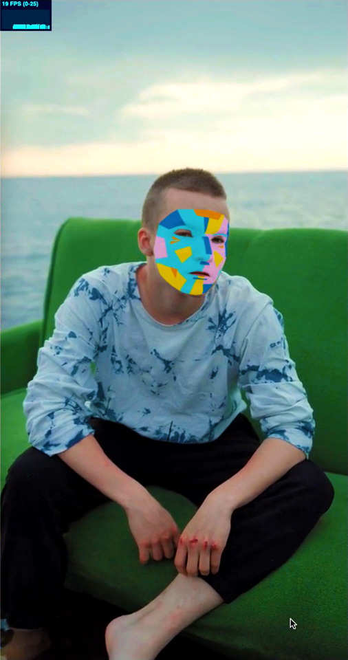
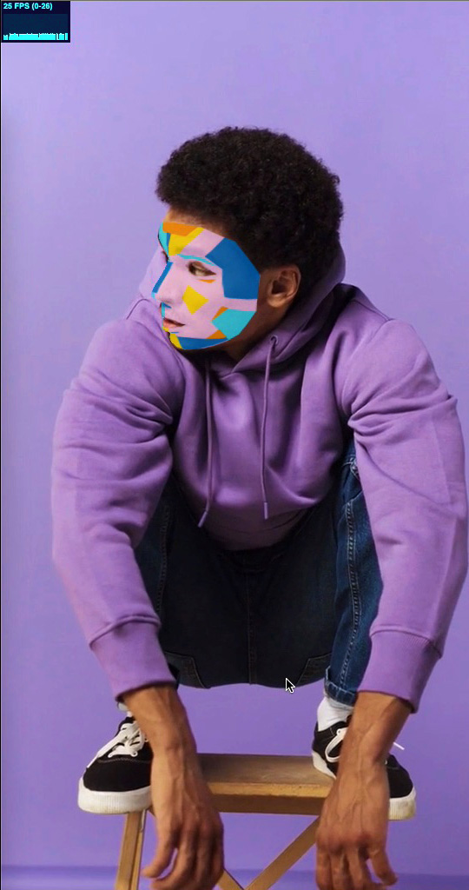
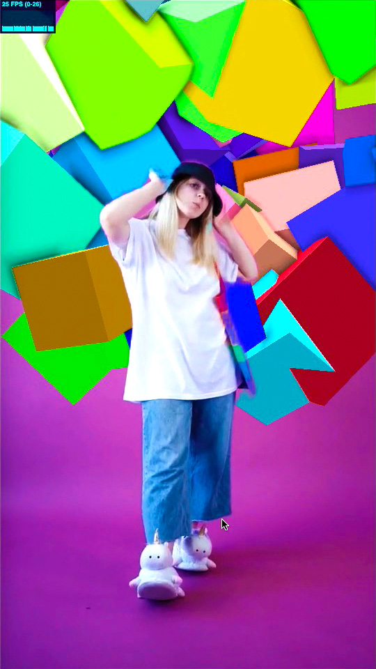
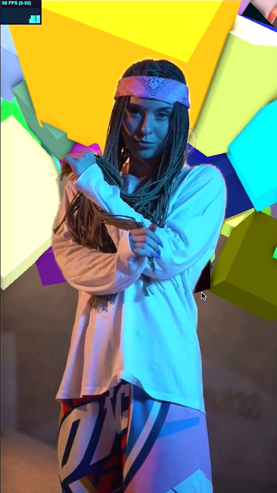

# MediaPipe+three.js Effect Examples

* [MediaPipe](https://google.github.io/mediapipe)
* [three.js](https://threejs.org)

## FaceMesh Effect Example
[MediaPipe Face Mesh](https://google.github.io/mediapipe/solutions/face_mesh.html)

* [Video Example](https://hideyuki-machida.github.io/MediaPipe-three.js-Effect-Examples/face_mesh/video.html)
* [Camera Example](https://hideyuki-machida.github.io/MediaPipe-three.js-Effect-Examples/face_mesh/camera.html)

 

video1: [https://www.pexels.com/video/a-young-man-with-scars-on-his-face-sitting-on-a-couch-by-the-river-10536927/](https://www.pexels.com/video/a-young-man-with-scars-on-his-face-sitting-on-a-couch-by-the-river-10536927/) 
video2: [https://www.pexels.com/video/a-man-posing-while-squatting-on-a-barstool-7763785/
](https://www.pexels.com/video/a-man-posing-while-squatting-on-a-barstool-7763785/
)

## Segmentation Effect Example
[MediaPipe Selfie Segmentation](https://google.github.io/mediapipe/solutions/selfie_segmentation.html)

* [Video Example](https://hideyuki-machida.github.io/MediaPipe-three.js-Effect-Examples/selfie_segmentation/video.html)
* [Camera Example](https://hideyuki-machida.github.io/MediaPipe-three.js-Effect-Examples/selfie_segmentation/camera.html)

 

video1: [https://www.pexels.com/video/stylish-girl-posing-8670824/](https://www.pexels.com/video/stylish-girl-posing-8670824/) 
video2: [https://www.pexels.com/video/woman-wearing-bandana-looking-at-camera-8688822/](https://www.pexels.com/video/woman-wearing-bandana-looking-at-camera-8688822/)

## Objectron Effect Example
[MediaPipe Objectron](https://google.github.io/mediapipe/solutions/objectron.html)
